# BÁO CÁO THIẾT KẾ MODULE 1: TRAINING & MODEL MANAGEMENT MODULE

**Sinh viên thực hiện:** [Tên bạn]
**Mã sinh viên:** [MSSV]
**Lớp:** [Tên lớp]

---

## 1. TỔNG QUAN MODULE

### 1.1. Vai trò trong hệ thống
Module 1 đóng vai trò **quản lý dữ liệu huấn luyện và model ML/AI** cho hệ thống chatbot. Module này:
- Quản lý dữ liệu huấn luyện (nhãn, mẫu: thêm/sửa/xóa)
- Huấn luyện và retrain các model ML
- Quản lý versioning cho models
- Cung cấp API để Server 2 lấy model và documents
- Lưu trữ dữ liệu học máy và models

### 1.2. Chức năng chính
1. **Training Data Management**: Quản lý nhãn và mẫu huấn luyện
2. **Model Training & Retraining**: Huấn luyện model mới và retrain model cũ
3. **Model Version Control**: Quản lý các version của model
4. **Document Sync API**: Đồng bộ documents sang Server 2
5. **Admin Dashboard Integration**: Tích hợp với giao diện quản trị

### 1.3. Công nghệ sử dụng
- **Backend Framework**: Flask / FastAPI
- **ML Framework**: scikit-learn / PyTorch / TensorFlow
- **Database**: PostgreSQL / MySQL
- **File Storage**: Local filesystem / S3
- **Task Queue**: Celery + Redis (cho async training)
- **Model Registry**: MLflow (optional)

---

## 2. THIẾT KẾ CƠ SỞ DỮ LIỆU

### 2.1. Training Data Schema (PostgreSQL)

#### Table: `labels`
```sql
CREATE TABLE labels (
    label_id SERIAL PRIMARY KEY,
    label_name VARCHAR(100) UNIQUE NOT NULL,
    description TEXT,
    category VARCHAR(50), -- 'tuyen_sinh', 'hoc_phi', etc.
    created_at TIMESTAMP DEFAULT CURRENT_TIMESTAMP,
    updated_at TIMESTAMP DEFAULT CURRENT_TIMESTAMP,
    created_by VARCHAR(36), -- admin user_id
    is_active BOOLEAN DEFAULT TRUE
);
```

#### Table: `training_samples`
```sql
CREATE TABLE training_samples (
    sample_id SERIAL PRIMARY KEY,
    label_id INTEGER REFERENCES labels(label_id),
    content TEXT NOT NULL,
    sample_type VARCHAR(20) DEFAULT 'text', -- 'text', 'qa_pair', 'intent'
    metadata JSONB, -- {source, quality_score, etc.}
    created_at TIMESTAMP DEFAULT CURRENT_TIMESTAMP,
    updated_at TIMESTAMP DEFAULT CURRENT_TIMESTAMP,
    created_by VARCHAR(36),
    is_active BOOLEAN DEFAULT TRUE
);

CREATE INDEX idx_training_samples_label ON training_samples(label_id);
CREATE INDEX idx_training_samples_active ON training_samples(is_active);
```

#### Table: `qa_pairs`
```sql
CREATE TABLE qa_pairs (
    qa_id SERIAL PRIMARY KEY,
    question TEXT NOT NULL,
    answer TEXT NOT NULL,
    category VARCHAR(50),
    keywords TEXT[], -- Array of keywords
    metadata JSONB,
    created_at TIMESTAMP DEFAULT CURRENT_TIMESTAMP,
    updated_at TIMESTAMP DEFAULT CURRENT_TIMESTAMP,
    created_by VARCHAR(36),
    is_active BOOLEAN DEFAULT TRUE
);

CREATE INDEX idx_qa_category ON qa_pairs(category);
CREATE INDEX idx_qa_keywords ON qa_pairs USING GIN(keywords);
```

### 2.2. Model Management Schema

#### Table: `models`
```sql
CREATE TABLE models (
    model_id SERIAL PRIMARY KEY,
    model_name VARCHAR(100) NOT NULL,
    model_type VARCHAR(50), -- 'classifier', 'embedding', 'qa'
    version VARCHAR(20) NOT NULL,
    file_path VARCHAR(500) NOT NULL,
    config JSONB, -- Model configuration
    metrics JSONB, -- {accuracy, f1_score, etc.}
    training_params JSONB, -- {epochs, batch_size, lr, etc.}
    created_at TIMESTAMP DEFAULT CURRENT_TIMESTAMP,
    created_by VARCHAR(36),
    status VARCHAR(20) DEFAULT 'training', -- 'training', 'completed', 'deployed', 'archived'
    is_active BOOLEAN DEFAULT FALSE,
    UNIQUE(model_name, version)
);

CREATE INDEX idx_models_status ON models(status);
CREATE INDEX idx_models_active ON models(is_active);
```

#### Table: `training_jobs`
```sql
CREATE TABLE training_jobs (
    job_id SERIAL PRIMARY KEY,
    model_id INTEGER REFERENCES models(model_id),
    job_type VARCHAR(20), -- 'train', 'retrain', 'finetune'
    status VARCHAR(20) DEFAULT 'pending', -- 'pending', 'running', 'completed', 'failed'
    start_time TIMESTAMP,
    end_time TIMESTAMP,
    logs TEXT,
    error_message TEXT,
    metrics JSONB,
    created_by VARCHAR(36),
    created_at TIMESTAMP DEFAULT CURRENT_TIMESTAMP
);
```

### 2.3. Document Storage Schema

#### Table: `documents`
```sql
CREATE TABLE documents (
    doc_id SERIAL PRIMARY KEY,
    filename VARCHAR(255) NOT NULL,
    file_path VARCHAR(500) NOT NULL,
    doc_type VARCHAR(50), -- 'pdf', 'docx', 'txt', 'html'
    category VARCHAR(50),
    content TEXT, -- Extracted text content
    metadata JSONB, -- {page_count, file_size, etc.}
    upload_time TIMESTAMP DEFAULT CURRENT_TIMESTAMP,
    uploaded_by VARCHAR(36),
    processed BOOLEAN DEFAULT FALSE,
    synced_to_server2 BOOLEAN DEFAULT FALSE,
    last_sync_time TIMESTAMP
);

CREATE INDEX idx_documents_category ON documents(category);
CREATE INDEX idx_documents_processed ON documents(processed);
```

---

## 3. THIẾT KẾ LỚP THỰC THỂ (CLASS DIAGRAM)

### 3.1. Entity Classes

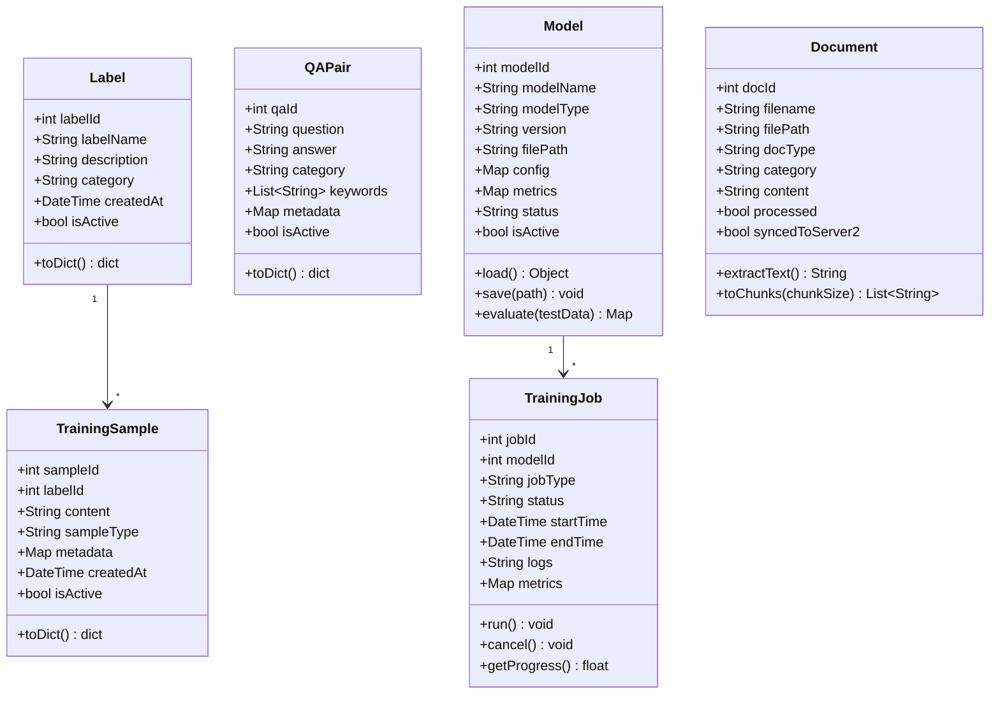

---

## 4. THIẾT KẾ CHI TIẾT CÁC CHỨC NĂNG

---

## CHỨC NĂNG 1: TRAINING DATA MANAGEMENT

### 4.1.1. Mô tả
Quản lý dữ liệu huấn luyện bao gồm labels, training samples, và QA pairs.

### 4.1.2. Thiết kế giao diện API

#### Endpoint 1: `POST /api/v1/labels`
Tạo label mới

**Request:**
```json
{
    "label_name": "hoc_phi_cntt",
    "description": "Câu hỏi về học phí ngành CNTT",
    "category": "hoc_phi",
    "created_by": "admin_001"
}
```

**Response:**
```json
{
    "success": true,
    "data": {
        "label_id": 15,
        "label_name": "hoc_phi_cntt",
        "description": "Câu hỏi về học phí ngành CNTT",
        "category": "hoc_phi",
        "created_at": "2025-01-15T10:30:00Z",
        "is_active": true
    }
}
```

#### Endpoint 2: `POST /api/v1/samples`
Thêm training sample

**Request:**
```json
{
    "label_id": 15,
    "content": "Học phí ngành CNTT năm 2025 là bao nhiêu?",
    "sample_type": "text",
    "metadata": {
        "source": "manual_input",
        "quality_score": 0.9
    },
    "created_by": "admin_001"
}
```

**Response:**
```json
{
    "success": true,
    "data": {
        "sample_id": 1052,
        "label_id": 15,
        "content": "Học phí ngành CNTT năm 2025 là bao nhiêu?",
        "created_at": "2025-01-15T10:35:00Z"
    }
}
```

#### Endpoint 3: `GET /api/v1/samples?label_id=15&limit=50`
Lấy danh sách samples theo label

**Response:**
```json
{
    "success": true,
    "data": {
        "total": 150,
        "samples": [
            {
                "sample_id": 1052,
                "label_id": 15,
                "content": "Học phí ngành CNTT năm 2025 là bao nhiêu?",
                "sample_type": "text",
                "created_at": "2025-01-15T10:35:00Z"
            }
        ],
        "pagination": {
            "page": 1,
            "limit": 50,
            "total_pages": 3
        }
    }
}
```

#### Endpoint 4: `DELETE /api/v1/samples/{sample_id}`
Xóa sample (soft delete)

**Response:**
```json
{
    "success": true,
    "message": "Sample deleted successfully"
}
```

### 4.1.3. Biểu đồ lớp chi tiết

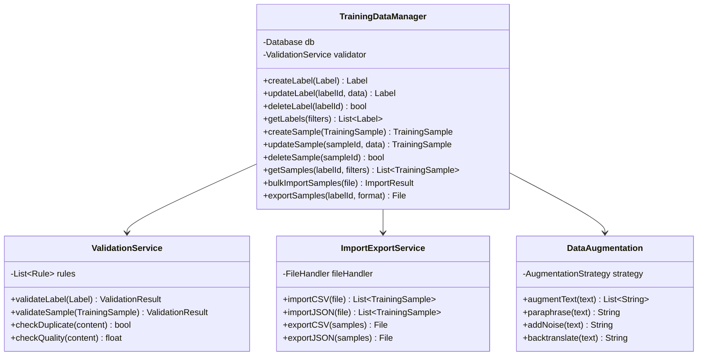

**Giải thích:**

1. **TrainingDataManager** (Main controller)
   - `createLabel()`: Tạo label mới với validation
   - `createSample()`: Thêm training sample
   - `bulkImportSamples()`: Import hàng loạt từ CSV/JSON
   - `exportSamples()`: Export samples để backup hoặc chia sẻ

2. **ValidationService** (Data validation)
   - `validateLabel()`: Kiểm tra label name unique, không rỗng
   - `validateSample()`: Kiểm tra content quality, format
   - `checkDuplicate()`: Phát hiện duplicate samples
   - `checkQuality()`: Đánh giá chất lượng sample (length, grammar, etc.)

3. **ImportExportService** (Bulk operations)
   - Support nhiều format: CSV, JSON, Excel
   - Batch processing để tối ưu performance

4. **DataAugmentation** (Data enhancement)
   - `augmentText()`: Tạo variants của text (synonym replacement, etc.)
   - `paraphrase()`: Paraphrase câu
   - `backtranslate()`: Dịch qua lại để tạo variations

### 4.1.4. Biểu đồ hoạt động

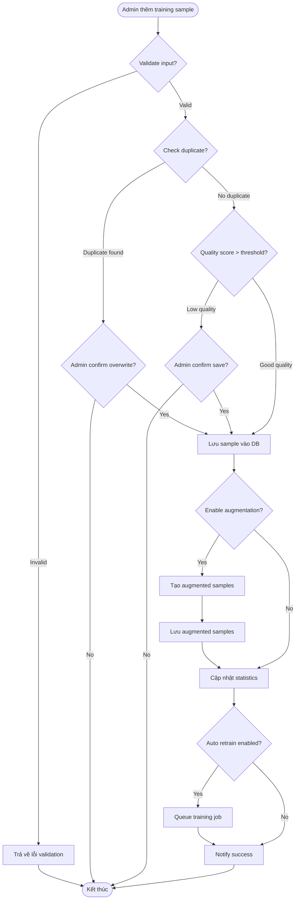

### 4.1.5. Biểu đồ tuần tự

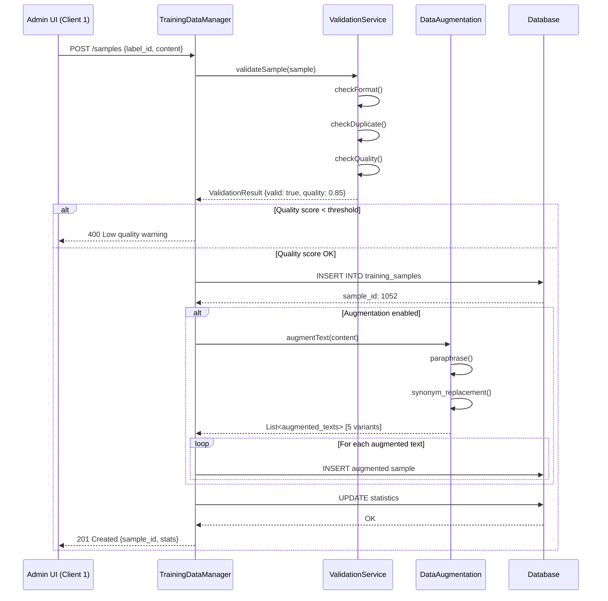

---

## CHỨC NĂNG 2: MODEL TRAINING & RETRAINING

### 4.2.1. Mô tả
Huấn luyện model mới hoặc retrain model hiện có với dữ liệu mới.

### 4.2.2. Thiết kế giao diện API

#### Endpoint 1: `POST /api/v1/models/train`
Bắt đầu training job

**Request:**
```json
{
    "model_name": "ptit_classifier_v2",
    "model_type": "classifier",
    "job_type": "retrain",
    "config": {
        "algorithm": "random_forest",
        "hyperparameters": {
            "n_estimators": 100,
            "max_depth": 10,
            "min_samples_split": 5
        },
        "train_test_split": 0.8,
        "validation_split": 0.1
    },
    "data_filters": {
        "labels": [1, 2, 5, 15],
        "date_from": "2025-01-01"
    },
    "created_by": "admin_001"
}
```

**Response:**
```json
{
    "success": true,
    "data": {
        "job_id": 42,
        "model_id": 18,
        "status": "pending",
        "estimated_time_minutes": 15,
        "message": "Training job queued successfully"
    }
}
```

#### Endpoint 2: `GET /api/v1/training/jobs/{job_id}`
Kiểm tra trạng thái training job

**Response:**
```json
{
    "success": true,
    "data": {
        "job_id": 42,
        "status": "running",
        "progress": 0.65,
        "current_step": "Training epoch 65/100",
        "start_time": "2025-01-15T11:00:00Z",
        "estimated_completion": "2025-01-15T11:12:00Z",
        "logs": "Epoch 65/100 - loss: 0.245, accuracy: 0.892..."
    }
}
```

#### Endpoint 3: `GET /api/v1/models?status=deployed`
Lấy danh sách models

**Response:**
```json
{
    "success": true,
    "data": {
        "models": [
            {
                "model_id": 17,
                "model_name": "ptit_classifier_v1",
                "version": "1.0.3",
                "model_type": "classifier",
                "status": "deployed",
                "metrics": {
                    "accuracy": 0.912,
                    "f1_score": 0.898,
                    "precision": 0.905,
                    "recall": 0.891
                },
                "created_at": "2025-01-10T08:00:00Z",
                "is_active": true
            }
        ]
    }
}
```

#### Endpoint 4: `POST /api/v1/models/{model_id}/deploy`
Deploy model

**Response:**
```json
{
    "success": true,
    "message": "Model deployed successfully",
    "data": {
        "model_id": 18,
        "version": "2.0.0",
        "deployed_at": "2025-01-15T11:30:00Z"
    }
}
```

### 4.2.3. Biểu đồ lớp chi tiết

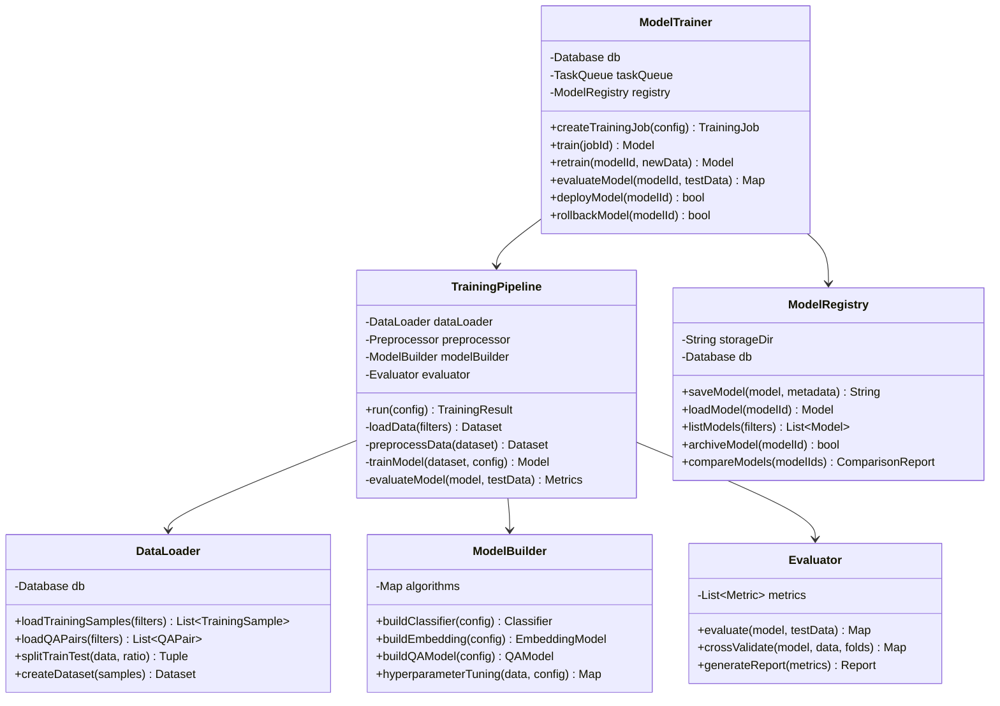

**Giải thích:**

1. **ModelTrainer** (Main orchestrator)
   - `createTrainingJob()`: Tạo async training job
   - `train()`: Execute training pipeline
   - `deployModel()`: Deploy model sang production
   - `rollbackModel()`: Rollback về version trước nếu có vấn đề

2. **TrainingPipeline** (Training workflow)
   - `run()`: End-to-end training pipeline
   - `loadData()`: Load data từ DB với filters
   - `preprocessData()`: Cleaning, tokenization, encoding
   - `trainModel()`: Train với config parameters
   - `evaluateModel()`: Evaluate trên test set

3. **DataLoader** (Data management)
   - `loadTrainingSamples()`: Load samples theo filters
   - `splitTrainTest()`: Split data theo ratio
   - `createDataset()`: Chuyển sang format Dataset

4. **ModelBuilder** (Model construction)
   - `buildClassifier()`: Xây dựng classifier (RF, XGBoost, etc.)
   - `buildEmbedding()`: Train embedding model
   - `hyperparameterTuning()`: Grid search / Random search

5. **Evaluator** (Model evaluation)
   - `evaluate()`: Tính metrics (accuracy, F1, precision, recall)
   - `crossValidate()`: K-fold cross validation
   - `generateReport()`: Tạo báo cáo chi tiết

6. **ModelRegistry** (Model storage)
   - `saveModel()`: Lưu model file + metadata
   - `loadModel()`: Load model by ID
   - `compareModels()`: So sánh performance các models

### 4.2.4. Biểu đồ hoạt động

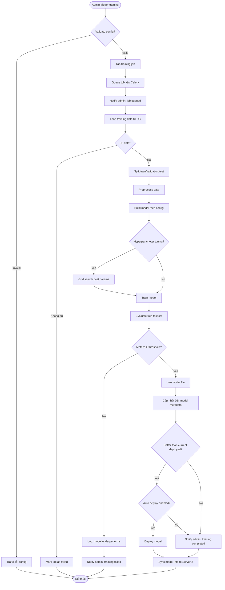

### 4.2.5. Biểu đồ tuần tự

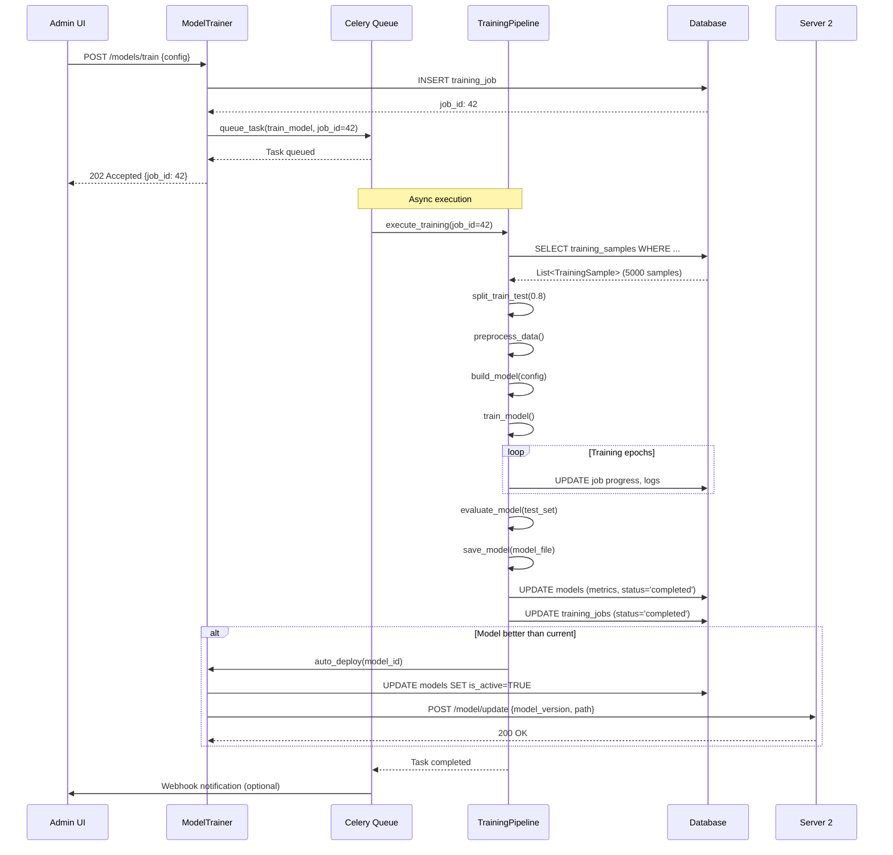

---

## CHỨC NĂNG 3: DOCUMENT SYNC TO SERVER 2

### 4.3.1. Mô tả
Xử lý documents (PDF, DOCX, etc.), extract text, và đồng bộ sang Server 2 để indexing vào vector DB.

### 4.3.2. Thiết kế giao diện API

#### Endpoint 1: `POST /api/v1/documents/upload`
Upload document

**Request:** (multipart/form-data)
```
file: tuyen_sinh_2025.pdf
category: tuyen_sinh
metadata: {"year": 2025, "source": "ptit_official"}
uploaded_by: admin_001
```

**Response:**
```json
{
    "success": true,
    "data": {
        "doc_id": 523,
        "filename": "tuyen_sinh_2025.pdf",
        "file_size_mb": 2.5,
        "status": "processing",
        "message": "Document uploaded and queued for processing"
    }
}
```

#### Endpoint 2: `POST /api/v1/documents/{doc_id}/sync`
Đồng bộ document sang Server 2

**Response:**
```json
{
    "success": true,
    "data": {
        "doc_id": 523,
        "chunks_created": 145,
        "synced_to_server2": true,
        "sync_time": "2025-01-15T12:05:00Z"
    }
}
```

#### Endpoint 3: `GET /api/v1/documents?synced=false`
Lấy danh sách documents chưa sync

**Response:**
```json
{
    "success": true,
    "data": {
        "total": 12,
        "documents": [
            {
                "doc_id": 520,
                "filename": "hoc_phi_2025.pdf",
                "category": "hoc_phi",
                "processed": true,
                "synced_to_server2": false,
                "upload_time": "2025-01-15T09:00:00Z"
            }
        ]
    }
}
```

### 4.3.3. Biểu đồ lớp chi tiết

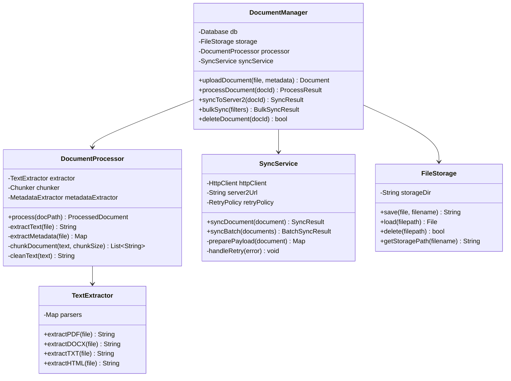

**Giải thích:**

1. **DocumentManager** (Main controller)
   - `uploadDocument()`: Upload và lưu file
   - `processDocument()`: Extract text và chunk
   - `syncToServer2()`: Đồng bộ sang Server 2
   - `bulkSync()`: Sync nhiều documents cùng lúc

2. **DocumentProcessor** (Document processing)
   - `process()`: Pipeline xử lý document
   - `extractText()`: Extract text từ PDF/DOCX/etc
   - `chunkDocument()`: Chia document thành chunks
   - `cleanText()`: Loại bỏ noise, normalize

3. **TextExtractor** (Format-specific extraction)
   - `extractPDF()`: PyPDF2 / pdfplumber
   - `extractDOCX()`: python-docx
   - `extractHTML()`: BeautifulSoup

4. **SyncService** (Server 2 integration)
   - `syncDocument()`: Gửi document chunks sang Server 2
   - `syncBatch()`: Batch sync để tối ưu
   - Retry logic cho network errors

5. **FileStorage** (File management)
   - Lưu files vào filesystem hoặc S3
   - Organize theo category/date

### 4.3.4. Biểu đồ hoạt động

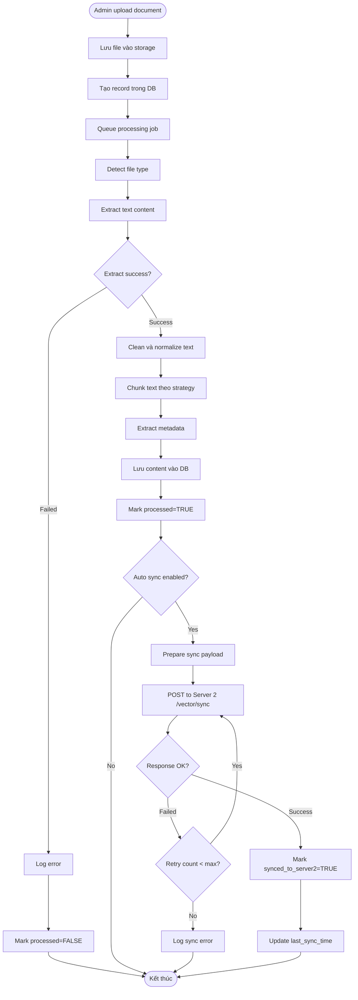

### 4.3.5. Biểu đồ tuần tự

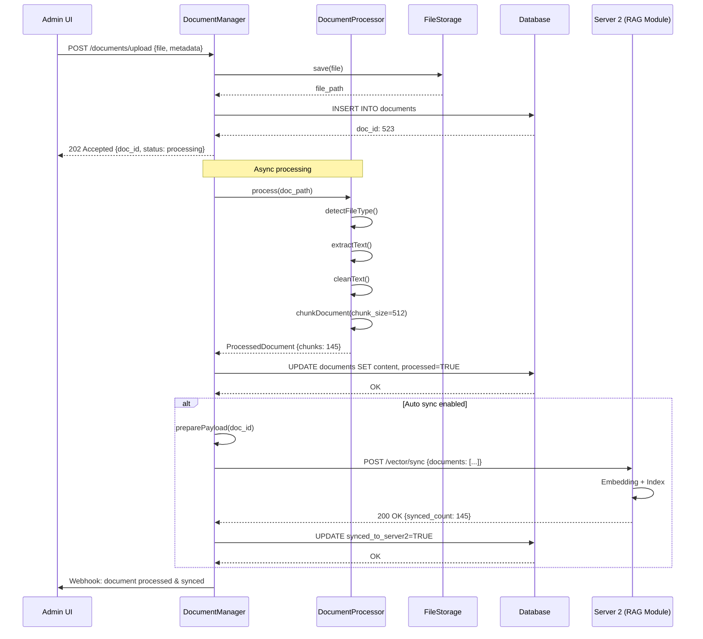

---

## 5. TƯƠNG TÁC VỚI CÁC MODULE KHÁC

### 5.1. Tương tác với Server 2 (RAG Module)

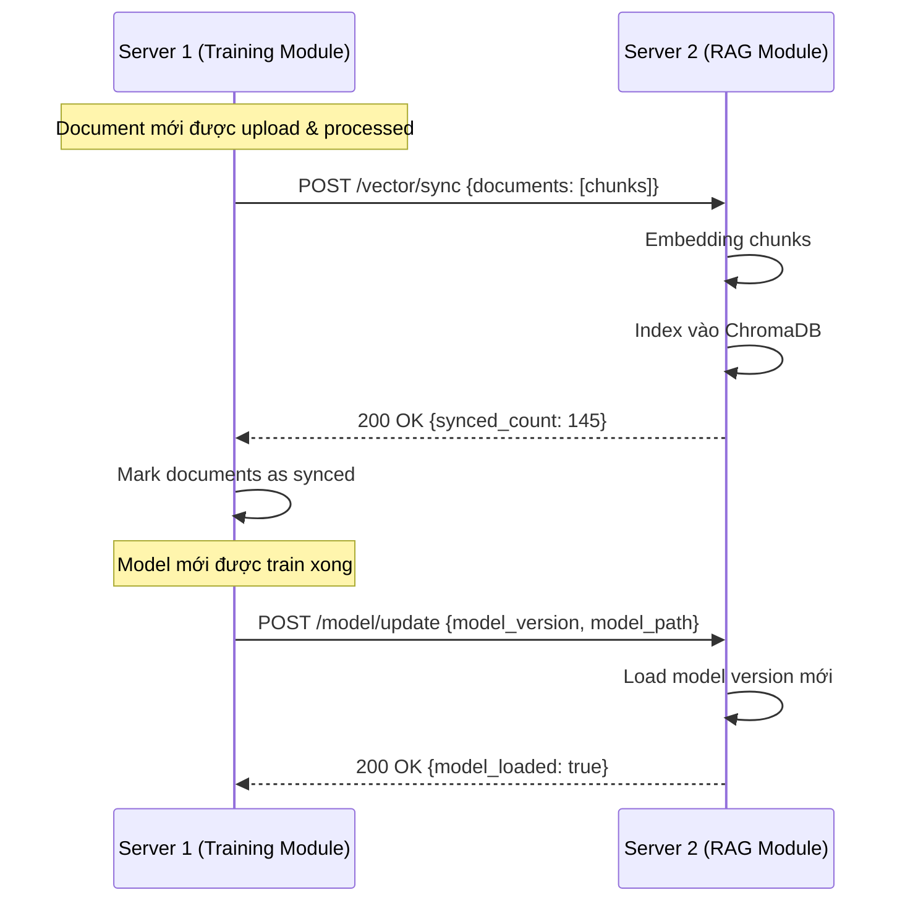

**API cung cấp cho Server 2:**
- `POST /api/v1/vector/sync`: Sync documents
- `POST /api/v1/model/update`: Notify model update
- `GET /api/v1/documents/latest`: Get latest documents

### 5.2. Tương tác với Client 1 (Admin UI)

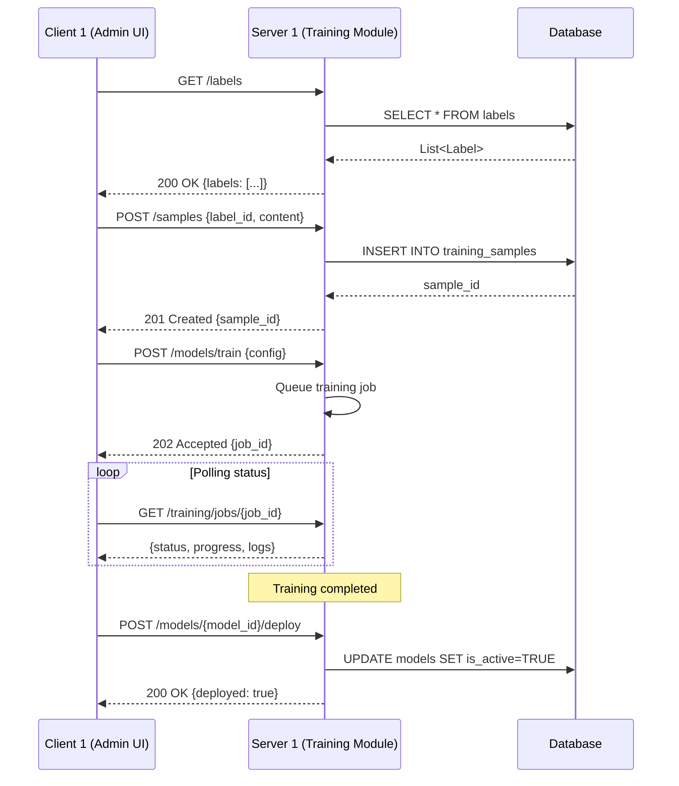

### 5.3. Biểu đồ triển khai

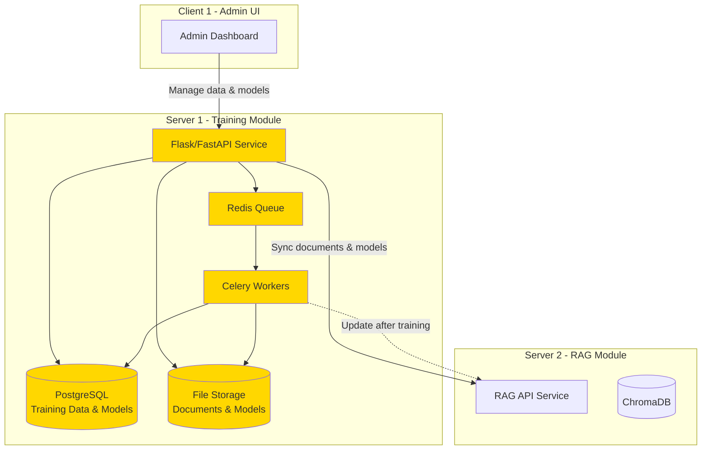

---

## 6. ĐÁNH GIÁ & TỐI ƯU HÓA

### 6.1. Metrics theo dõi

1. **Training Metrics:**
   - Training job success/failure rate
   - Average training time per job
   - Model performance metrics (accuracy, F1, etc.)
   - Data augmentation coverage

2. **Data Quality Metrics:**
   - Number of samples per label
   - Label distribution balance
   - Duplicate detection rate
   - Average sample quality score

3. **System Metrics:**
   - API response time
   - Document processing time
   - Storage usage
   - Sync success rate to Server 2

### 6.2. Chiến lược tối ưu hóa

1. **Training Optimization:**
   - Async training với Celery
   - Hyperparameter tuning automation
   - Early stopping để giảm thời gian training
   - Model caching để tránh retrain không cần thiết

2. **Data Management:**
   - Batch import/export
   - Automatic data augmentation
   - Duplicate detection
   - Data versioning

3. **Document Processing:**
   - Parallel processing cho multiple documents
   - Incremental sync (chỉ sync delta)
   - Compression trước khi sync

4. **Storage:**
   - Archive old models
   - Compression cho documents
   - S3 for scalable storage

---

## 7. KẾT LUẬN

### 7.1. Tổng kết
Module 1 (Training & Model Management) là nền tảng ML của hệ thống:
- **Quản lý dữ liệu**: Labels, samples, QA pairs với validation & augmentation
- **Training pipeline**: Automated training, evaluation, deployment
- **Integration**: Sync documents & models sang Server 2

Thiết kế tập trung vào:
- **Automation**: Async jobs, auto deployment, auto sync
- **Quality**: Data validation, model evaluation, duplicate detection
- **Scalability**: Batch processing, Celery workers, model registry

### 7.2. Công việc tiếp theo
1. Implement training data CRUD APIs
2. Setup Celery + Redis cho async training
3. Implement document processing pipeline
4. Integration testing với Server 2
5. Build Admin UI components

---

**Ngày hoàn thành:** [Ngày/Tháng/Năm]
**Chữ ký:** _______________
